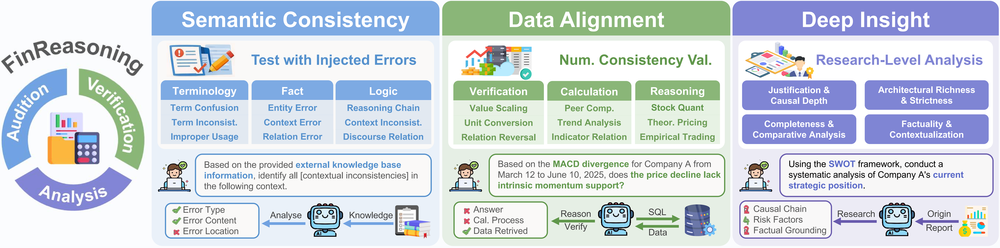

<div style="text-align:center">
<h2>From Generation to Decision: A Hierarchical Benchmark for Reliable Financial Reasoning with LLMs</h2>
</div>

<div align="center">


[English](README.md)

</div>

# 简介

FinReasoning 是一个专注于中文金融领域大模型推理能力的评测基准。它旨在全面评估大语言模型在金融场景下的逻辑一致性、事实对齐能力以及深度分析能力：
* **语义一致性评估 (Semantic Consistency)**：评估模型潜在的幻觉风险，重点检测模型能够识别金融文本中逻辑错误、上下文矛盾、因果倒置等问题的能力。
* **对齐与事实核查 (Data Alignment)**：不仅关注文本生成，更侧重于评估模型在特定金融场景下的数值计算与事实验证能力，例如复杂的财报分析、多指标对比等。
* **深度分析 (Deep Analysis)**：检验模型在理解复杂金融问题、提供严谨论证以及逻辑自洽的深度分析方面的能力。

未来，FinReasoning 将继续深化金融推理评测体系，结合更多的真实业务场景，为金融大模型的能力边界提供更精确的度量。

<div align="center">
  
  <br />
</div>

# 目录

- [FinReasoning 基准详情](#finreasoning-基准详情)
- [数据示例](#数据示例)
- [快速开始](#快速开始)
- [测试结果](#测试结果)

# FinReasoning 基准详情

## 数据构成

FinReasoning 包含 4800 条高质量的金融评测数据，涵盖了一致性、对齐性和深度分析三个主要方面。

| 任务                                   | 评测类别             | 细分维度        | 解释                                                         | 数量 |
| -------------------------------------- | -------------------- | --------------- | ------------------------------------------------------------ | ---- |
| **语义一致性（Semantic Consistency）** | 专业术语评估         | 术语使用不一致  | 同一概念多种表述，破坏严谨性                                 | 200  |
|                                        |                      | 术语使用不规范  | 使用口语化或非领域规范词汇                                   | 200  |
|                                        |                      | 术语混淆        | 使用语义相似但定义不同的词汇                                 | 200  |
|                                        | 事实性评估           | 关系错误        | 事件的谓词、动作、关系描述错误                               | 200  |
|                                        |                      | 实体错误        | 关键实体写错或主客体反转                                     | 200  |
|                                        |                      | 情境错误        | 时间、地点、数量、方式等修饰成分错误                         | 200  |
|                                        | 逻辑评估             | 推理链错误      | 逻辑断层、跳步或矛盾推理                                     | 200  |
|                                        |                      | 语篇关系错误    | 时间顺序、因果关系错误                                       | 200  |
|                                        |                      | 上下文不一致    | 结论与前文设定冲突                                           | 200  |
| **跨域样本对齐（Data Alignment）**     | 简单对齐与事实核查   | 数值修改        | 随机加减乘除原始值                                           | 150  |
|                                        |                      | 单位修改        | e.g. 将“元”换算为“万元/亿元”                                 | 150  |
|                                        |                      | 比较关系修改    | 篡改逻辑词                                                   | 150  |
|                                        |                      | 同义词替换      | 使用金融同义词典                                             | 150  |
|                                        | 复杂数值计算与分析   | 单日期多指标    | 单个日期的多个指标复合计算                                   | 200  |
|                                        |                      | 多日期单指标    | 单指标的跨日期对比与计算                                     | 200  |
|                                        |                      | 多日期多指标    | 多个指标的跨日期对比与计算                                   | 200  |
|                                        |                      | 跨公司/行业对比 | 排名、最大值/最小值、分组比较等                              | 200  |
|                                        | 规则驱动的一致性验证 | /               | 综合理解规则逻辑与结构化指标间的定量关系                     | 400  |
| **深度分析（Deep Analysis）**          | 论证合理性与因果深度 | /               | 推理是否符合商业逻辑，因果链条（A->B->C）是否清晰完整        | 300  |
|                                        | 事实准确性与情境化   | /               | 模型是否准确引用了证据中的关键事实（如获批品种、财务预测）来支撑论点 | 300  |
|                                        | 完整性与比较分析     | /               | 核心考察批判性思维。模型是否识别了潜在风险、执行局限或制衡因素，而非一面倒的乐观/悲观。 | 300  |
|                                        | 结构丰富度与严谨性   | /               | 输出的逻辑框架是否专业，概念深度是否达标                     | 300  |

## 评测指标

我们提出了一套全面的评估机制，对结果的各个维度进行评分，并通过对下列各细分指标的归一化数值应用简单平均加权从而计算出每个赛道的综合得分。

| **赛道**                               | **评测指标**         | 方法              | 客观/主观 |
| -------------------------------------- | -------------------- | ----------------- | --------- |
| **语义一致性**（Semantic Consistency） | 错误定位准确率       | Sentence-F1       | 客观      |
|                                        | 错误解释质量         | BERTScore/SimCSE  | 客观      |
|                                        |                      | LLM-as-a Judge    | 主观      |
|                                        | 内容修正质量         | BERTScore/SimCSE  | 客观      |
|                                        |                      | LLM-as-a Judge    | 主观      |
| **跨域样本对齐（Data Alignment）**     | 回答准确率           | Accuracy          | 客观      |
|                                        | 检索准确率           | F1-Score(Data ID) | 客观      |
|                                        |                      | F1-Score(Field）  | 客观      |
| **深度分析（Deep Analysis）**          | 结构丰富度与严谨性   | LLM-as-a Judge    | 主观      |
|                                        | 事实准确性与情境化   | LLM-as-a Judge    | 主观      |
|                                        | 完整性与比较分析     | LLM-as-a Judge    | 主观      |
|                                        | 论证合理性与因果深度 | LLM-as-a Judge    | 主观      |

# 数据示例

每个任务的评测数据均为 JSON 格式，包含了问题、答案及相关的元数据。为节省篇幅，长文本字段已截断，但保留了完整的数据结构。

### 1. 语义一致性 (Semantic Consistency)

考察模型识别金融文本中实体错误（如机构名、职务等）的能力。

```json
{
  "qa_id": "fact_entity_error_qa_001",
  "source": "long_text_0001",
  "category": "Fact_Evaluation",
  "dimension": "Factual_Entity_Error",
  "question": "你是一名专业的金融事实核查专家...[长文本省略]...",
  "answer": {
      "factual_error_exists": "是",
      "factual_errors": [
        {
          "error_location": "中国证券监督管理委员会维持了宽松的货币政策基调...",
          "wrong_entity": "中国证券监督管理委员会",
          "correct_entity": "中国人民银行（央行）",
          "error_type": "实体错误",
          "reason": "中国证券监督管理委员会（证监会）主要负责..."
        }
      ],
      "error_explanation": "文本包含3处实体错误...[解释文本省略]...",
      "corrected_text": "...[修正后的长文本省略]..."
  },
  "benchmark_type": "Consistency",
  "metadata": {
      "error_type": "factual_entity_error",
      "modified_text": "...[含错误的长文本省略]...",
      "num_errors": 3,
      "original_metadata": {
          "original_text_type": "analysis",
          "num_source_chunks": 6
      }
  }
}
```

### 2. 跨域样本对齐 (Data Alignment)

考察模型根据特定股票代码、日期和指标进行精确数值查询与核对的能力。

```json
{
  "qa_id": "qa_1_000001",
  "source": "",
  "category": "L1_Simple",
  "dimension": "Simple_Fact_Checking",
  "question": "XXX股份有限公司的2025年10月31日的daily_tafactor是否低于6.930547？",
  "answer": "否",
  "benchmark_type": "Alignment",
  "metadata": {
    "question_type": "comparison",
    "modification_type": null,
    "data_ids": [
      3472463
    ],
    "date": "2025-10-31",
    "indicator": "daily_tafactor",
    "stcode": "xxx",
    "calculation_results": [],
    "domain": ""
  }
}
```

### 3. 深度分析 (Deep Analysis)

考察模型对复杂金融逻辑的推演与论证能力。

```json
{
  "qa_id": "334",
  "source": "790284965309",
  "category": "JCD_Justification_Causal_Depth",
  "dimension": "",
  "question": "请深入分析童装业务增速“环比提升”...[长文本省略]...",
  "answer": "对361度童装业务的分析如下...[长文本省略]...",
  "benchmark_type": "Depth",
  "metadata": {
      "evidence": "研报显示...[证据文本省略]..."
  }
}
```

# 快速开始

## 安装

我们建议使用 Python 3.8+ 环境。

```bash
# 克隆仓库
git clone https://github.com/TongjiFinLab/FinReasoning.git
cd FinReasoning

# 安装依赖
pip install -r requirements.txt
```

> **注意**：Alignment 任务依赖 `data/Alignment/datebase` 目录下的 CSV 数据文件 (`stock_data.csv`, `database_sample.csv`)。用户也可以根据自己的使用需求进行数据扩充与配置。

## 评测

我们在根目录下为您准备了统一的评测入口 `main.py`。

### LLM 配置详情

本框架支持两种方式配置 LLM（模型、API Key、Base URL）：

**方式 1：代码直接配置 **

打开 `main.py`，找到 `LLM_SETTINGS` 配置块进行修改：


**方式 2：环境变量配置**

如果您希望保护 Key 不被提交到代码仓库，可以将 `main.py` 中的 `api_key` 和 `base_url` 设为 `None`，并设置如下环境变量：

- `OPENAI_API_KEY`: 您的 API Key
- `OPENAI_BASE_URL`: API 服务地址

### 基本用法

```bash
python main.py --task <task_name> [options]
```

### 参数说明

- `--task`: **必选**。评测任务类型 (`alignment`, `consistency`, `depth`, `all`)。
- `--input-path`: 输入数据路径 (默认自动搜索对应的文件夹)。
- `--output-dir`: 结果输出根目录 (默认 `eval_results`)。
- `--test-run`: 测试模式，每个任务仅运行一条数据。

> **注意**：结果将按照 `输出目录/时间戳/任务/模型名称` 的层级结构保存。

### 运行示例

**示例 1：运行一致性 (Consistency) 评测**
```bash
python main.py --task consistency
```

**示例 2：运行对齐 (Alignment) 评测**
```bash
python main.py --task alignment
```

**示例 3：运行深度 (Depth) 评测**
```bash
python main.py --task depth
```

**示例 4：测试运行模式 (快速验证)**
使用 `--test-run` 参数，每个任务仅处理 1 条数据，用于检查环境配置是否正确。
```bash
python main.py --task all --test-run
```

