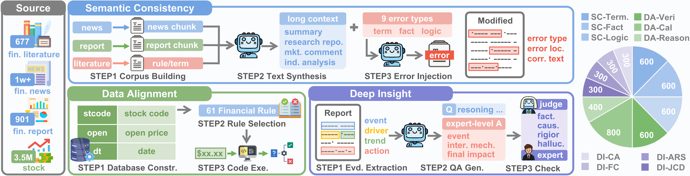

<div style="text-align:center">
<h2>From Generation to Decision: A Hierarchical Benchmark for Reliable Financial Reasoning with LLMs</h2>
</div>

<div align="center">


[简体中文](README-CN.md)

</div>

# 📖 Introduction

FinReasoning is a benchmark focused on evaluating the reasoning capabilities of Large Language Models (LLMs) in the Chinese financial domain. It aims to comprehensively assess the logical consistency, factual alignment, and depth of analysis of LLMs in financial scenarios:
* **Semantic Consistency**: Evaluates potential hallucination risks, focusing on detecting logical errors, context contradictions, and reversed causality in financial texts.
* **Data Alignment**: Focuses not only on text generation but also on evaluating numerical calculation and fact verification capabilities in specific financial scenarios, such as complex financial report analysis and multi-indicator comparison.
* **Deep Insight**: Examines the model's ability to understand complex financial problems, provide rigorous argumentation, and perform self-consistent logical analysis.

In the future, FinReasoning will continue to deepen the financial reasoning evaluation system, incorporating more real-world business scenarios to provide more precise measurements of the capability boundaries of financial LLMs.

<div align="center">
  
  <br />
</div>

# 📚 Table of Contents

- [🧠 FinReasoning Benchmark Details](#finreasoning-benchmark-details)
- [📂 Data Examples](#data-examples)
- [🚀 Quick Start](#quick-start)
- [📊 Test Results](#test-results)

# 🧠 FinReasoning Benchmark Details

An overview of the FinReasoning benchmark, presenting its data sources, the construction procedures for each task,and the data statistics including the number of sub-tasks within each track.
<div align="center">
  
  <br />
</div>

## Benchmark Construction

FinReasoning contains 4800 high-quality financial evaluation data items, covering three main aspects: consistency, alignment, and deep analysis.

| Track                                 | Category             | Dimension       | Explantion                                                   | Number |
| ------------------------------------- | -------------------- | --------------- | ------------------------------------------------------------ | ------ |
| **Semantic Consistency**              | Terminology Assessment | Inconsistent Terminology Usage | Multiple expressions for the same concept, undermining rigor | 200    |
|                                       |                      | Improper Terminology | Use of colloquial or non-domain standard vocabulary        | 200    |
|                                       |                      | Terminology Confusion             | Use of words with similar semantics but different definitions | 200    |
|                                       | Factual Assessment   | Relation Error           | Errors in predicates, actions, or relationship descriptions of events | 200    |
|                                       |                      | Entity Error             | Wrong key entities or subject-object reversal                | 200    |
|                                       |                      | Context Error            | Errors in modifiers such as time, location, quantity, manner, etc. | 200    |
|                                       | Logic Assessment     | Reasoning Chain Error    | Logical gaps, skipped steps, or contradictory reasoning      | 200    |
|                                       |                      | Discourse Relation Error | Errors in chronological order or causal relationships        | 200    |
|                                       |                      | Context Inconsistency    | Conclusion conflicts with previous settings                  | 200    |
| **Data Alignment**                    | Simple Alignment & Verification | Value Modification       | Random addition, subtraction, multiplication, or division of original values | 150    |
|                                       |                      | Unit Modification        | e.g. Converting "Yuan" to "Ten Thousand Yuan/Hundred Million Yuan" | 150    |
|                                       |                      | Comparison Relation Modification | Tampering with logical words                                 | 150    |
|                                       |                      | Synonym Replacement      | Using financial synonym dictionary                           | 150    |
|                                       | Complex Numerical Calculation       | Single Date Multi-Indicator | Composite calculation of multiple indicators for a single date | 200    |
|                                       |                      | Multi-Date Single Indicator | Cross-date comparison and calculation for a single indicator | 200    |
|                                       |                      | Multi-Date Multi-Indicator  | Cross-date comparison and calculation for multiple indicators | 200    |
|                                       |                      | Cross-Company/Industry Comparison | Ranking, Max/Min, Group comparison, etc.                     | 200    |
|                                       | Rule-Driven Reasoning               | /               | Comprehensive understanding of the quantitative relationship between rule logic and structured indicators | 400    |
| **Deep Insight** | Justification & Causal Depth | /               | Whether the reasoning conforms to business logic, and whether the causal chain (A->B->C) is clear and complete | 300    |
|                                       | Factuality & Contextualization | /               | Whether the model accurately cites key facts (such as approved varieties, financial forecasts) from evidence to support arguments | 300    |
|                                       | Completeness & Comparative Analysis     | /               | Core assessment of critical thinking. Whether the model identifies potential risks, execution limitations, or counterbalancing factors, rather than being one-sidedly optimistic/pessimistic. | 300    |
|                                       | Architectural Richness & Strictness | /               | Whether the output logical framework is professional and the concept depth meets standards | 300    |

## Evaluation Metrics

We present a comprehensive  evaluation mechanism to score diverse dimensions of the results, and compute a composite score for each track by applying simple average weighting to the normalized values of the constituent metrics listed below.

| **Track**                    | **Evaluation Metrics**  | Method            | Obj./Subj. |
| ---------------------------- | ----------------------- | ----------------- | ---------- |
| **Semantic** **Consistency** | Error Location Accuracy | Sentence-F1       | Objective  |
|                              | Error Explanation       | BERTScore/SimCSE  | Objective  |
|                              |                         | LLM-as-a Judge    | Subjective |
|                              | Correct Content         | BERTScore/SimCSE  | Objective  |
|                              |                         | LLM-as-a Judge    | Subjective |
| **Data Alignment**           | Success Rate                       | Rate              | Objective  |
|  | Answer Accuracy | Accuracy | Objective |
|                              | Retrieval Accuracy      | F1-Score(Data ID) | Objective  |
|                              |                         | F1-Score(Field)  | Objective  |
| **Deep Insight**             | Category-specific Scoring Criteria| LLM-as-a Judge    | Subjective |

# 📂 Data Examples

The data for each task is in JSON format, containing questions, answers, and relevant metadata. To save space, long text fields have been truncated, but the complete data structure is preserved.

### 1. Semantic Consistency

Evaluates the model's ability to identify entity errors (e.g., organization names, positions) in financial texts.

```json
{
  "qa_id": "fact_entity_error_qa_001",
  "source": "long_text_0001",
  "category": "Fact_Evaluation",
  "dimension": "Factual_Entity_Error",
  "question": "你是一名专业的金融事实核查专家...[Long Text Omitted]...",
  "answer": {
      "factual_error_exists": "是",
      "factual_errors": [
        {
          "error_location": "中国证券监督管理委员会维持了宽松的货币政策基调...",
          "wrong_entity": "中国证券监督管理委员会",
          "correct_entity": "中国人民银行（央行）",
          "error_type": "实体错误",
          "reason": "中国证券监督管理委员会（证监会）主要负责..."
        }
      ],
      "error_explanation": "文本包含3处实体错误...[Explanation Omitted]...",
      "corrected_text": "...[Corrected Text Omitted]..."
  },
  "benchmark_type": "Consistency",
  "metadata": {
      "error_type": "factual_entity_error",
      "modified_text": "...[Modified Text Omitted]...",
      "num_errors": 3,
      "original_metadata": {
          "original_text_type": "analysis",
          "num_source_chunks": 6
      }
  }
}
```

### 2. Data Alignment

Evaluates the model's capability to perform precise numerical queries and verification based on specific stock codes, dates, and indicators.

```json
{
  "qa_id": "qa_1_000001",
  "source": "",
  "category": "Verification",
  "dimension": "Simple_Fact_Checking",
  "question": "XXX股份有限公司的2025年10月31日的daily_tafactor是否低于6.930547？",
  "answer": "否",
  "benchmark_type": "Alignment",
  "metadata": {
    "question_type": "comparison",
    "modification_type": null,
    "data_ids": [
      3472463
    ],
    "date": "2025-10-31",
    "indicator": "daily_tafactor",
    "stcode": "xxx",
    "calculation_results": [],
    "domain": ""
  }
}
```

### 3. Deep Analysis

Evaluates the model's ability to deduce and argue complex financial logic.

```json
{
  "qa_id": "334",
  "source": "790284965309",
  "category": "JCD_Justification_Causal_Depth",
  "dimension": "",
  "question": "请深入分析童装业务增速“环比提升”...[Long Text Omitted]...",
  "answer": "对361度童装业务的分析如下...[Long Text Omitted]...",
  "benchmark_type": "Depth",
  "metadata": {
      "evidence": "研报显示...[Evidence Omitted]..."
  }
}
```

# 🚀 Quick Start

## Installation

We recommend using a Python 3.8+ environment.

```bash
# Clone repository
git clone https://github.com/TongjiFinLab/FinReasoning.git
cd FinReasoning

# Install dependencies
pip install -r requirements.txt
```

> **Note**: The Alignment task relies on CSV data files (`stock_data.csv`, `database_sample.csv`) in the `data/Alignment/datebase` directory. Users can also expand and configure data according to their own needs.

## Project Structure

```text
FinReasoning/
├── data/                   # Evaluation datasets
│   ├── Alignment/          # Alignment task data (JSON & Database CSVs)
│   ├── Consistency/        # Consistency task data (JSON/JSONL)
│   └── Depth/              # Depth task data (JSON)
├── src/                    # Source code for evaluators
│   ├── Evaluate_Alignment.py
│   ├── Evaluate_Consistency.py
│   ├── Evaluate_Depth.py
│   └── Evaluation_prompt.py
├── eval_results/           # Output directory (Auto-generated)
├── main.py                 # Unified entry point
├── requirements.txt        # Python dependencies
└── README.md               # Documentation
```

## Input & Output

- **Input**:
  - The framework automatically searches for datasets in `data/Alignment`, `data/Consistency`, and `data/Depth` by default.
  - You can also specify a custom file or directory using the `--input-path` argument.

- **Output**:
  - All evaluation results are saved in the `eval_results/` directory by default.
  - **Directory Structure**: `eval_results/<Timestamp>/<Task>/<Model_Name>/`
    - Meanings: Execution time / Task type / Model name (sanitized).
  - **File Content**: JSON files containing detailed model inputs, outputs, judge reasoning, and final scores.

## Evaluation

We have prepared a unified evaluation entry point `main.py` in the root directory.

### LLM Configuration Details

This framework supports two ways to configure the LLM (model, API Key, Base URL):

**Method 1: Environment Variable Configuration**

If you wish to protect your Key from being committed to the code repository, you can set `api_key` and `base_url` to `None` in `main.py` and set the following environment variables:

- `OPENAI_API_KEY`: Your API Key
- `OPENAI_BASE_URL`: API Base URL

**Method 2: Direct Code Configuration**

Open `main.py`, find the `LLM_SETTINGS` configuration block and modify it.


### Basic Usage

```bash
python main.py --task <task_name> [options]
```

### Parameter Description

- `--task`: **Required**. Evaluation task type (`alignment`, `consistency`, `depth`, `all`).
- `--input-path`: Input data path (defaults to automatic search in corresponding folders).
- `--output-dir`: Result output root directory (default `eval_results`).
- `--test-run`: Test mode, processes only one data item per task.

> **Note**: Results will be saved in a hierarchical structure: `Output Directory/Timestamp/Task/Model Name`.

### Running Examples

**Example 1: Run Consistency Evaluation**

```bash
python main.py --task consistency
```

**Example 2: Run Alignment Evaluation**
```bash
python main.py --task alignment
```

**Example 3: Run Depth Evaluation**
```bash
python main.py --task depth
```

**Example 4: Test Run Mode (Quick Verification)**
Use the `--test-run` parameter to process only 1 data item per task, used to check if the environment configuration is correct.
```bash
python main.py --task all --test-run
```

# 🧪 Performance of LLMs

Performance comparison of LLMs across different tracks (The full leaderboard is ranked by the Overall Normalized Score). ARS=Architectural Richness and Strictness; FC=Factuality and Contextualization; CA=Completeness and Comparative Analysis; JCD=Justification and Causal Depth; Avg.=Average Score; Norm=Normlized Score.

| Model             | Semantic Consistency |      |       |       |        | Data Alignment |             |           |       |        | Deep Insight |      |      |      |       |        | Overall_Norm |
| ----------------- | -------------------- | ---- | ----- | ----- | ------ | -------------- | ----------- | --------- | ----- | ------ | ------------ | ---- | ---- | ---- | ----- | ------ | ------------ |
|                   | Terminology          | Fact | Logic | Avg.S | Norm.S | Verification   | Calculation | Reasoning | Avg.S | Norm.S | ARS          | F&C  | C&A  | JCD  | Avg.S | Norm.S |              |
| Doubao-Seed-1.8   | 63.9                 | 74.4 | 63.3  | 67.2  | 100.0  | 93.5           | 66.6        | 55.6      | 71.9  | 92.1   | 93.5         | 87.2 | 86.2 | 95.7 | 90.6  | 98.3   | 96.8         |
| GPT-5             | 64.3                 | 71.4 | 57.6  | 64.4  | 94.9   | 88.3           | 72.8        | 68.5      | 76.5  | 100    | 92.4         | 84.6 | 86.7 | 81.8 | 86.4  | 91.1   | 95.4         |
| Kimi-K2           | 49.5                 | 66.0 | 59.1  | 58.2  | 83.7   | 90.2           | 69.3        | 63.2      | 74.2  | 96.1   | 93.4         | 87.4 | 89.5 | 96.3 | 91.6  | 100    | 93.3         |
| Claude-sonnet-4.5 | 54.9                 | 69.0 | 51.8  | 58.6  | 84.4   | 85.3           | 64.6        | 62.7      | 70.9  | 90.4   | 92.2         | 87.1 | 84.5 | 96.2 | 90.0  | 97.3   | 90.7         |
| GLM-4.6           | 59.0                 | 73.4 | 62.5  | 65.0  | 96.0   | 89.4           | 67.5        | 58.4      | 59.4  | 70.7   | 92.6         | 88.1 | 87.3 | 96.1 | 91.0  | 99     | 88.6         |
| Gemini-3-pro      | 63.1                 | 71.1 | 50.2  | 61.5  | 89.7   | 94.3           | 69.9        | 56.8      | 73.7  | 95.2   | 82.1         | 79.0 | 76.7 | 80.7 | 79.6  | 79.5   | 88.1         |
| Qwen3-Max         | 51.2                 | 70.0 | 57.1  | 59.4  | 85.9   | 92.3           | 67.1        | 66.3      | 75.2  | 97.8   | 85.8         | 76.0 | 75.8 | 82.9 | 80.1  | 80.4   | 88           |
| DeepSeek-V3       | 41.7                 | 63.1 | 54.0  | 52.9  | 74.1   | 91.8           | 63.7        | 60.4      | 72.0  | 92.3   | 82.0         | 81.0 | 77.9 | 86.4 | 81.8  | 83.3   | 83.2         |
| Intern-S1         | 39.5                 | 57.1 | 35.4  | 44.0  | 58.0   | 88.8           | 62.9        | 53.9      | 68.5  | 86.3   | 84.4         | 82.1 | 81.6 | 88.0 | 84.0  | 87     | 77.1         |
| GPT-4o            | 35.7                 | 53.8 | 37.6  | 42.4  | 55.2   | 90.4           | 61.0        | 63.1      | 71.5  | 91.4   | 80.0         | 77.6 | 74.8 | 76.9 | 77.3  | 75.6   | 74.1         |
| Qwen3-235B        | 40.3                 | 57.7 | 33.0  | 43.7  | 57.5   | 90.1           | 63.1        | 54.2      | 69.1  | 87.3   | 75.4         | 63.8 | 63.7 | 67.5 | 67.6  | 59     | 68           |
| DeepSeek-R1       | 51.6                 | 66.9 | 46.7  | 55.0  | 77.9   | 25.7           | 68.9        | 22.5      | 39.1  | 36     | 88.0         | 84.6 | 80.0 | 89.8 | 85.6  | 89.8   | 67.9         |
| Qwen3-32B         | 38.1                 | 54.9 | 34.2  | 42.4  | 55.2   | 91.6           | 55.7        | 65.0      | 70.8  | 90.2   | 73.6         | 61.7 | 60.3 | 65.7 | 65.3  | 55.1   | 66.8         |
| Qwen3-8B          | 32.4                 | 46.1 | 37.6  | 38.7  | 48.5   | 83.5           | 51.8        | 54.2      | 63.2  | 77.2   | 69.3         | 51.1 | 53.9 | 57.4 | 57.9  | 42.5   | 56.1         |
| Fin-R1            | 21.4                 | 22.6 | 24.2  | 22.8  | 19.7   | 65.4           | 40.6        | 38.6      | 48.2  | 51.5   | 77.9         | 71.8 | 73.5 | 71.5 | 73.7  | 69.5   | 46.9         |
| Llama-3.1-70B     | 19.7                 | 28.8 | 20.4  | 23.0  | 20.1   | 88.2           | 61.3        | 61.3      | 70.3  | 89.4   | 42.6         | 36.5 | 34.7 | 36.8 | 37.7  | 8      | 39.2         |
| DianJin-R1-7B     | 19.1                 | 22.7 | 20.3  | 20.7  | 15.9   | 65.9           | 20.1        | 6.9       | 30.9  | 21.9   | 77.1         | 63.6 | 73.3 | 69.1 | 70.8  | 64.5   | 34.1         |
| Llama-3.1-8B      | 19.4                 | 21.1 | 16.9  | 19.2  | 13.2   | 78.4           | 49.1        | 42.6      | 56.7  | 66.1   | 39.1         | 30.8 | 31.3 | 32.1 | 33.3  | 0.5    | 26.6         |
| TouchstoneGPT     | 12.0                 | 12.0 | 11.6  | 11.9  | 0.0    | 23.8           | 17.9        | 12.6      | 18.1  | 0      | 38.3         | 28.7 | 30.8 | 34.2 | 33.0  | 0      | 0            |
| Average           | 40.9                 | 52.7 | 40.7  | 44.8  | 59.5   | 79.8           | 57.6        | 50.9      | 62.1  | 75.4   | 76.8         | 69.6 | 69.6 | 73.9 | 72.5  | 67.4   | 67.4         |
